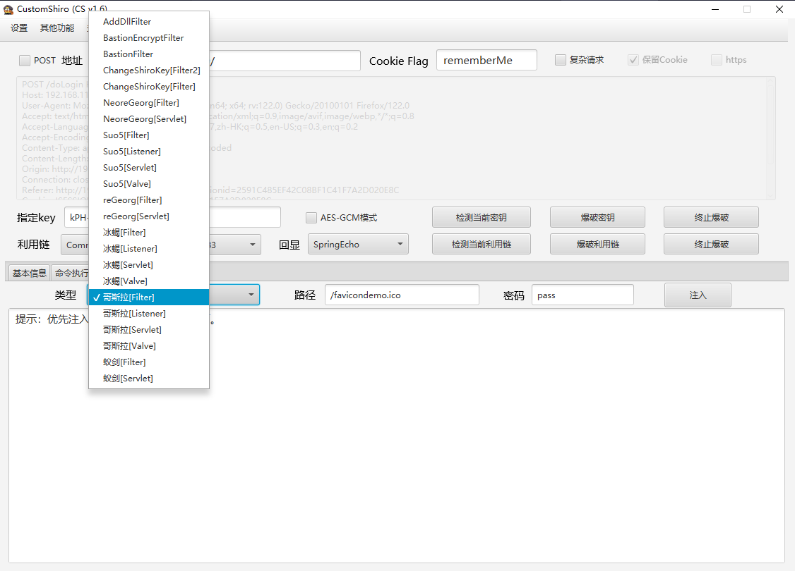
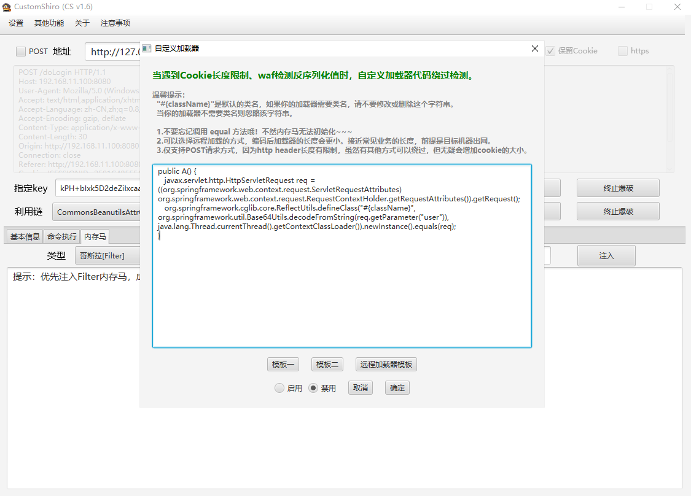

## 一款针对Shiro550漏洞进行快速漏洞利用

由于其他Shiro550工具对复杂请求支持比较差，因此在ShiroAttack基础上编写该Shiro工具。

## 欢迎提issues完善工具。

原作者：https://github.com/sma11new/Pyke-Shiro

参考：https://github.com/SummerSec/ShiroAttack2





## 打包

maven：

```
mvn package assembly:single
```

## 更新记录
- v1.6 (2025-4)
  
      修复GCM Key识别
      新增多个内存马
      支持自定义加载器

- v0.3 (2024-03-12)

      新增可选保留Cookie：复杂请求下可选择是否保留原始数据包中的Cookie内容
      新增自定义请求超时，在“设置-超时”菜单中
      修改命令执行时的参数放在Authorizations而不是Authorization，避免与身份认证冲突

- v0.2 (2024-03-07)

      修复bug：修复批量检测时请求头、请求体信息没带入数据包。

- v0.1 (2024-03-01)

      发布初版，实现基本功能。

## 使用
复杂请求可以是GET或POST，所有请求信息会被携带，可指定https，同时可选择是否保留原始数据包中的Cookie内容


其中由于Cookie既有身份验证，又有payload，因此采用以下逻辑尽可能确保在勾选保留Cookie的情况下无误，经测试未发现异常

```
假设前台输入的cookieFlag是rememberMe

复杂请求下如果勾选保留Cookie，两种情况：
	一、请求包中有cookie，两种情况：
	   1、原始cookie内容中包含rememberMe，两种情况：
			a）原始cookie只有rememberMe一项，则无需保留，直接返回cookie payload
			b）原始cookie除了rememberMe还有其他项，则需要保留其它项，添加rememberMe的值为cookie payload
	   2、原始cookie中不包含rememberMe，直接拼接cookie payload即可
	二、请求包中没cookie，不存在需要保留的内容，直接返回cookie payload
```

## 免责声明

本工具仅用于内部网络安全自查及授权项目，请勿非法使用，否则后果自负，使用前请认真阅读相关协议。
